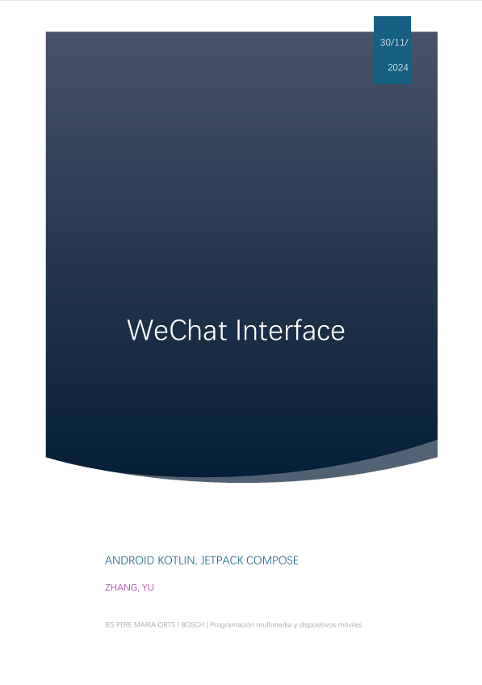
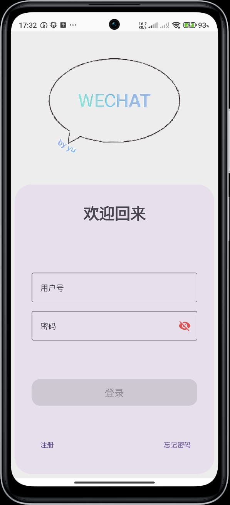
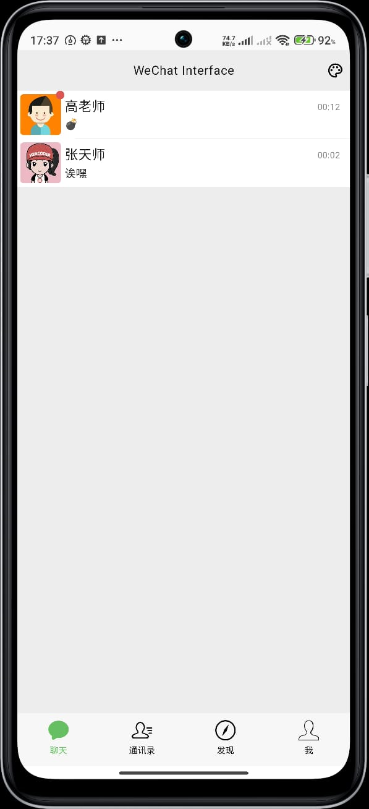
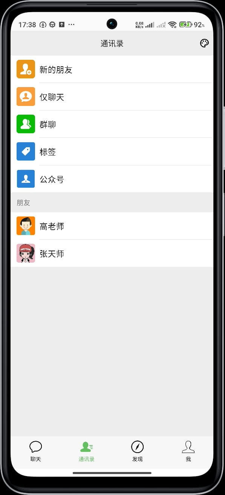
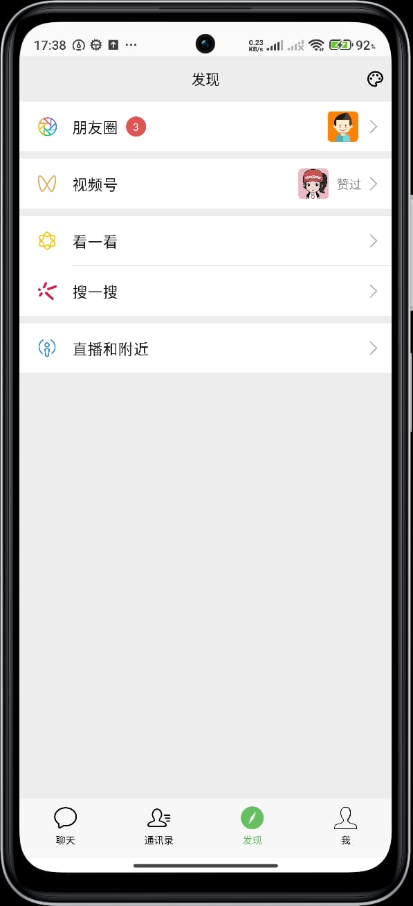
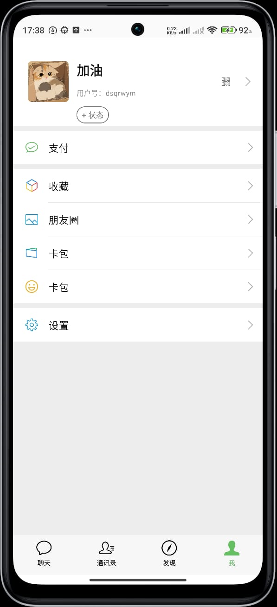
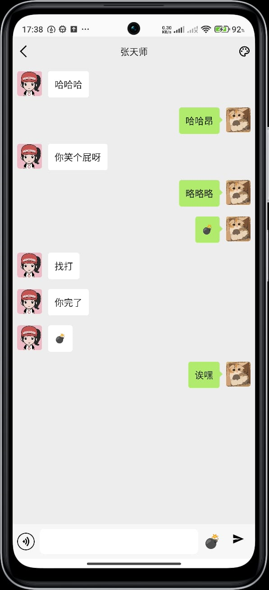

# 🌟 WeInterface
---
**感谢扔物线大佬提供的代码，这是一个模仿微信的应用程序（缺少很多功能）。**
---
**Gracias a rengwuxian por proporcionar el código.** 
Este es un proyecto que simula una aplicación similar a WeChat (aún faltan muchas funcionalidades).
---
**Special thanks to Tossline for providing the code.**
This is a project simulating an application similar to WeChat (still missing many features). 
---

## 📄 Descripción en PDF

[](assets/Descripcion.pdf)

Haz clic en la imagen o en el siguiente enlace para ver el documento completo:  
[📥 Descargar WeInterface.pdf](assets/Descripcion.pdf)


## 📖 Funcionalidades
- **Inicio de Sesión**: Los usuarios pueden ingresar con ID y contraseña.
- **Lista de Chats**: Visualiza las conversaciones y notificaciones de mensajes no leídos.
- **Pantalla de Chat**: Envía mensajes y utiliza efectos especiales como "bombas".
- **Desplazamiento automático**: Después de enviar un mensaje, la pantalla de chat se 
desplazará automáticamente hasta el mensaje más reciente.
- **Barra de navegación**:
  + En la parte superior de la pantalla de chat, hay una barra de 
    navegación que permite al usuario regresar a la pantalla anterior y cambiar el tema (hay 
    tres temas disponibles).
  + En la parte inferior de la pantalla de home, hay una barra de
    navegación que permite al usuario regresar a cuatro vistas diferentes:
      * Cuatro páginas: La pantalla principal está compuesta por cuatro páginas: 
          1. chatList: La primera página muestra la lista de chats, y el usuario puede hacer clic en un chat para entrar en la pantalla de chat.
          2. contactList: Muestra la lista de contactos del usuario (amigos).
          3. discoveryList: Solo visual.
          4. meList: Muestra la información personal del usuario, como su ID y foto de perfil.
---

## 🖼️ Capturas de Pantalla

### Vista Principal
<div style="display: flex; flex-wrap: wrap; gap: 10px; justify-content: center;">
  
  
  
  
</div>
### Vista ChatPage


---

## 👥 Cuentas de Prueba

| Usuario          | Contraseña   |
|------------------|--------------|
| **dsqrwym**      | 12345678     |
| **gaolaoshi**    | 66666666     |
| **zhangtianshi** | 88888888     |

---

## 🛠️ Tecnología
- **Kotlin**
- **Android Jetpack** (ViewModel, Navigation, Hilt)
- **Google Accompanist Pager**

---
## 🚀 Instalación
1. Clona el repositorio:
   ```bash
   git clone https://github.com/dsqrwym/WeChat_Interface.git
